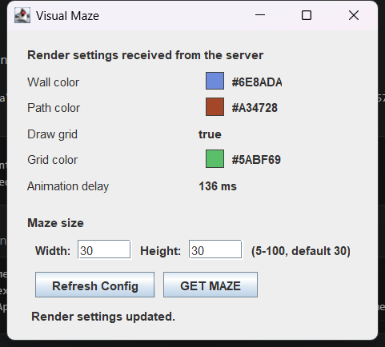
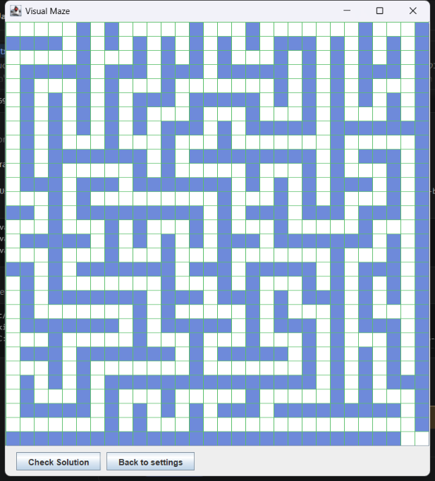
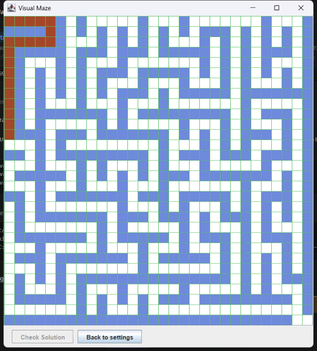
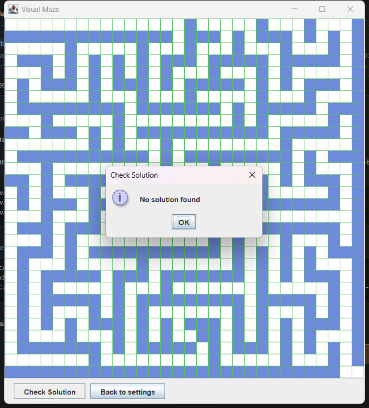

# Visual Maze

תוכנית Java עם Swing שבונה מבוך ויזואלי מתוך תמונה שמתקבלת מ-API, כתרגיל בקורס
תכנות מונחה עצמים.

התוכנית שולפת מהשרת הגדרות ציור, מקבלת ממנו תמונת מבוך בגודל שהמשתמש בחר, מפענחת
מתוך צבעי הפיקסלים איפה יש קיר ואיפה יש מעבר, ומציירת את המבוך בעצמה. תמונת המקור
עצמה אינה מוצגת בשום שלב — היא קלט בלבד.

---

## צילומי מסך

| מסך ההגדרות | המבוך |
|---|---|
|  |  |

| הפתרון באנימציה | כשאין פתרון |
|---|---|
|  |  |

---

## איך משתמשים

התוכנית נפתחת על מסך ההגדרות. המבוך עצמו עדיין אינו מוצג.

| פעולה | מה קורה |
|---|---|
| פתיחת התוכנית | נשלחת בקשה ל-`/fm1/get-render-config` וההגדרות מוצגות |
| **Refresh Config** | שליפה מחדש של ההגדרות בלבד. לא של המבוך |
| **Width** / **Height** | גודל המבוך. טווח 5 עד 100, ברירת מחדל 30 |
| **GET MAZE** | שליפת תמונת המבוך בגודל שנבחר, ומעבר למסך המבוך |
| **Check Solution** | חיפוש מסלול מהפינה השמאלית העליונה לימנית התחתונה |
| **Back to settings** | חזרה למסך ההגדרות |

ערך רוחב או גובה שאינו מספר, או שאינו בטווח, מטופל כ-30. הערך המתוקן נכתב חזרה
לשדה, כדי שיהיה ברור באיזה גודל התוכנית באמת השתמשה.

לחיצה על **Check Solution** במבוך שאין לו פתרון מציגה `No solution found`. אם יש
פתרון, המשבצות שלו נצבעות אחת אחרי השנייה. במהלך האנימציה הכפתור מנוטרל, כדי
שלא ירוצו שתי אנימציות במקביל. לחיצה לאחר סיומה מציגה את הפתרון מחדש, על מבוך נקי.

---

## הרצה

דרישה: JDK 17 ומעלה, וחיבור לאינטרנט. אין תלות בספריות חיצוניות ואין צורך בכלי בנייה.

### מ-IntelliJ IDEA

1. `File → Open` ולבחור את תיקיית הפרויקט.
2. לסמן את `src` כ-Sources Root ואת `test` כ-Test Sources Root, אם הסביבה לא זיהתה זאת לבד.
3. להריץ את המחלקה `maze.Main`.

### משורת הפקודה

ב-PowerShell:

```powershell
javac -encoding UTF-8 -d out (Get-ChildItem -Recurse src,test -Filter *.java).FullName
java -cp out maze.Main
```

ב-Linux ו-macOS:

```bash
javac -encoding UTF-8 -d out $(find src test -name "*.java")
java -cp out maze.Main
```

הדגל `-encoding UTF-8` נחוץ מפני שהתיעוד בקוד כתוב בעברית. ב-JDK 18 ומעלה זו ממילא
ברירת המחדל.

### בדיקות

```bash
java -cp out maze.MazeTests          # ליבה בלבד, רץ גם בלי אינטרנט
java -cp out maze.MazeTests --live   # כולל בדיקות מול השרת
```

הבדיקות מדפיסות שורה לכל בדיקה ומסיימות בקוד יציאה 1 אם משהו נכשל. אין תלות
ב-JUnit — הכל במחלקה אחת עם `main`, כמו שאר הפרויקט.

---

## מבנה הפרויקט

```
src/maze/
├── Main.java                  נקודת הכניסה
├── model/                     לוגיקה טהורה - ללא תלות ב-Swing
│   ├── RenderConfig.java      הגדרות הציור מהשרת, ופענוח ה-JSON
│   ├── MazeGrid.java          מבנה המבוך, ופענוחו מתמונת המקור
│   └── MazeSolver.java        חיפוש מסלול ב-BFS
├── ui/                        שכבת התצוגה
│   ├── MainFrame.java         החלון, קריאות הרשת והמעבר בין שני המסכים
│   ├── ConfigPanel.java       מסך ההגדרות ובחירת הגודל
│   └── MazePanel.java         ציור המבוך ואנימציית הפתרון
└── util/
    └── ApiService.java        קריאות ה-HTTP

test/maze/
└── MazeTests.java             בדיקות, ללא תלות בספריות חיצוניות
```

---

## שני ממצאים על השרת

שני הדברים האלה אינם תואמים את מה שכתוב בהנחיות התרגיל, ושניהם נבדקו מול השרת.

### התמונה אינה פיקסל אחד למשבצת

ההנחיות אומרות שכל פיקסל בתמונת המקור מייצג משבצת אחת. בפועל **השרת מחזיר בלוק של
16 על 16 פיקסלים לכל משבצת**:

| גודל שנתבקש | גודל התמונה שהתקבלה |
|---|---|
| 5 × 5 | 80 × 80 |
| 30 × 30 | 480 × 480 |
| 100 × 100 | 1600 × 1600 |
| 100 × 5 | 1600 × 80 |
| 7 × 53 | 112 × 848 |

היחס יצא 16 בדיוק בכל הגדלים שנבדקו, ללא שארית, וכל בלוק אחיד לחלוטין בצבעו — אין
בתמונה החלקה או שוליים מטושטשים, ולכן הפענוח חד-משמעי.

המשמעות המעשית: `image.getRGB(col, row)` היה מחזיר רק את 16 השורות הראשונות של
המבוך. לכן `MazeGrid.fromImage` דוגמת פיקסל אחד ממרכז כל משבצת, לפי היחס שבין גודל
התמונה לגודל שנתבקש. הדגימה ממרכז המשבצת ולא מפינתה נכונה גם אילו היחס היה משתנה
או מפסיק להיות שלם. בדיקת `--live` מוודאת שהיחס נשאר שלם, כדי שהחלפה בצד השרת
תתגלה כבדיקה שנכשלת ולא כמבוך שנראה אקראי.

### כתובת אחת מתוך השתיים אינה פעילה

בשלב 5 בהנחיות מופיעה הכתובת `backend-qcf9.onrender.com` עבור תמונת המבוך, אבל
המארח הזה מחזיר **404** לשני ה-endpoints. שאר ההנחיות, כולל דוגמת ה-URL באותו שלב
עצמו, מפנות למארח `shaitest-production-3066.up.railway.app`, שעונה כראוי לשתי
הכתובות. לכן `ApiService` פונה אליו בשני המקרים.

---

## החלטות תכנון

### הפרדה בין המודל לתצוגה

מחלקות `maze.model` אינן יודעות דבר על Swing. `MazeGrid` מקבלת `BufferedImage`
ומחזירה מבנה נתונים, ו-`MazeSolver` מקבלת `MazeGrid` ומחזירה רשימת נקודות. בזכות
זה אפשר לבדוק את כל הליבה בלי לפתוח חלון, וזה מה שמאפשר ל-`MazeTests` לרוץ על
תמונות שנבנות בקוד הבדיקה עצמו.

`MazePanel` עוסקת בציור בלבד. בגרסה מוקדמת יותר היא גם פענחה את התמונה וגם החזיקה
את המבוך, וזה ערבב שתי אחריות שאין ביניהן קשר.

### Threading

קריאת רשת אורכת זמן, ולכן היא לא יכולה לרוץ על ה-Event Dispatch Thread — החלון היה
נתקע עד שהשרת עונה. מנגד, אסור לגעת ברכיבי Swing מחוץ ל-EDT.

שתי הדרישות מתקיימות באמצעות `SwingWorker`: `doInBackground` פונה לשרת ומפענח את
התמונה, ורק `done` נוגע בממשק. לכן שדה ההגדרות נכתב ונקרא ב-EDT בלבד ואין צורך
בסנכרון כלל.

הכפתורים מנוטרלים למשך הבקשה, כדי שלחיצות חוזרות לא ייצרו בקשות מקבילות.

### שני מסכים ב-CardLayout

`MainFrame` מחזיק שני כרטיסים ומחליף ביניהם. מסך ההגדרות נפתח ראשון, ולכן לפני
לחיצה על **GET MAZE** אין מבוך על המסך ואין מה לבדוק. **Check Solution** נמצא על
מסך המבוך, שם הוא רלוונטי, ולא צריך לנטרל אותו בהתחלה.

`ConfigPanel` אינו יודע מה קורה בלחיצה על הכפתורים — הוא מקבל שני `ActionListener`
מבחוץ.

### גודל החלון

מבוך 100 על 100 הוא 2000 פיקסלים ברוחב, גדול מכל מסך. אזור הגלילה מוגבל ל-900 על
640, וגודל החלון נחתך לגבולות המסך. כך הכפתורים נשארים נגישים בכל גודל מבוך, והגלילה
מטפלת בשארית.

### מוסכמת הקואורדינטות

לאורך כל הפרויקט `col` היא עמודה, `row` היא שורה, וב-`Point` מתקיים `x = col` ו-
`y = row`. המערך הפנימי מאונדקס `[row][col]`, כמקובל, ולכן החלפת סדר הייתה שוברת
הכל בשקט. כל הגישות אליו עוברות דרך `MazeGrid.isOpen(col, row)`, ויש בדיקה על מבוך
לא ריבועי שתופסת בדיוק את השגיאה הזו — במבוך ריבועי היא בלתי נראית.

### ערכים שמגיעים מהשרת ואינם קבועים בקוד

צבע הקירות, צבע הנתיב, צבע הרשת, ההחלטה אם לצייר רשת וזמן ההמתנה — כולם מגיעים
מה-API. `RenderConfig.parse` **זורקת חריגה כששדה חסר**, במקום להשלים אותו בערך
ברירת מחדל.

זו לא הקפדה תיאורטית. המפענח הקודם חיפש בדיוק את המחרוזת `"key":`, ורווח אחד
בפורמט של השרת היה מפיל את כל השדות לערכים קבועים שהיו כתובים בקוד — התוכנית
הייתה נראית כאילו היא עובדת בזמן שהיא מציירת צבעים שהומצאו. הודעת שגיאה עדיפה על
תצוגה שקטה ושגויה.

`cellSize` הוא היוצא מן הכלל: הוא נקבע בקוד ל-20, כפי שהתרגיל מתיר במפורש.

### כמחצית מהמבוכים אינם פתירים

זו התנהגות של השרת ולא באג. בבדיקה על 15 מבוכים בגודל 30 על 30, 7 היו פתירים.
במבוכים שאינם פתירים שתי הפינות פתוחות אבל שייכות לשני רכיבי קשירות נפרדים.

לכן מסלול "אין פתרון" הוא תרחיש שכיח ולא מקרה קצה, ויש לו בדיקה משלו.

---

## עמידה בדרישות התרגיל

| דרישה | מימוש |
|---|---|
| חלון הגדרות ראשוני, ללא המבוך | `ConfigPanel` ככרטיס ראשון ב-`CardLayout` |
| הצגת הגדרות הציור מהשרת | חמש הגדרות, כל צבע עם ריבוע צבע לצד ערכו |
| כפתור `Refresh Config` | שולף מחדש רק את ההגדרות |
| שדות `width` ו-`height` | ברירת מחדל 30, טווח 5 עד 100, ערך פסול מטופל כ-30 |
| כפתור `GET MAZE` | `MainFrame.loadMaze` |
| קריאת התמונה ב-`BufferedImage` | `ApiService.fetchMazeImage` |
| פענוח קירות ומעברים מהפיקסלים | `MazeGrid.fromImage` |
| ציור עצמאי ב-Swing | `MazePanel.paintComponent` |
| מעבר לבן, קיר ב-`wallCellColor` | שם |
| רשת לפי `drawGrid` ו-`gridColor` | שם |
| כפתור `Check Solution` | על מסך המבוך בלבד |
| חיפוש מסלול בארבעה כיוונים | `MazeSolver.solve`, BFS |
| הודעה כשאין פתרון | `No solution found` |
| אנימציה לפי `pathColor` ו-`animationDelayMs` | `MazePanel.animateSolution` |
| מניעת אנימציות מקבילות | הכפתור מנוטרל, ו-`isAnimating` חוסם הפעלה חוזרת |
| איפוס והצגה מחדש בלחיצה נוספת | `animateSolution` מנקה את הנתיב הקודם |

---

## רישיון

הפרויקט מופץ תחת רישיון [GNU AGPL v3](LICENSE).
